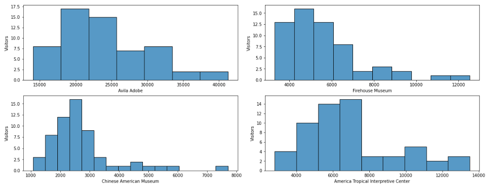
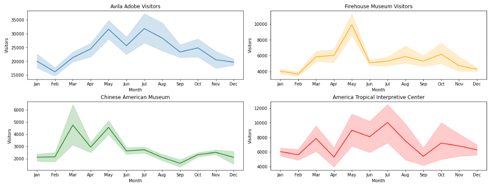
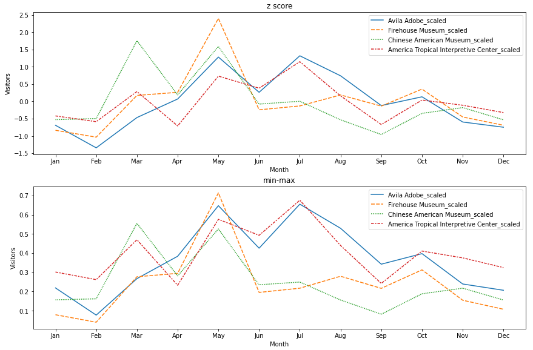

## Project Overview

#### The following is an exploration of a dataset on museum visitors in the US between Jan 2014 to Nov 2018. I load the dataset into an ipynb and perform some EDA and visualisations on it.   

Dataset file: [musemu visitors dataset](museum_visitors.csv)  
Python notebook: [EDA Notebook](museum_visitor_analysis.ipynb)  

## Data and Exploration
The dataset has 5 columns, with 1 column being the date ranging from Jan 2014 to Nov 2018 and 4 other columns being the visitor count of different museums in the US. I explore the following aspects of the data using the full date range provided:
- Visitor count per museum by date  
- Distribution of visitor count for each museum   
- Average visitor count per month for each museum  
- Normalized visitor count to assess seasonality effect over the year    

## Data Cleaning
We see the visitor counts per museum of each year from Jan 2014 to Nov 2018.    
    
Notice the visitor count for Firehouse Museum in Sep 2014 is particularly high. Under the assumption the visitor count is incorrectly recorded and not the result of any event/season/marketing effort, I imputed the visitor count for Firehouse Museum in September 2014.    

Assessing the seasonality of the Firehouse Museum visitors across the years.  
  
Although there is doesn't seem to be a consistent pattern for visitors in September each year, looking at the average of June to August for each year could be a decent approximation of September's visitor numbers.  
Years 2016 and 2017 have September's visitor count at the end of a downtrend whereas for 2015 and 2018, the visitor count ticks upwards. With heavier emphasis on 2015 for being more recent to 2014 as compared to other years, I simply used the mean visitors of June to August.  

See <b>2014-09-01</b> 
Before:  
  

After:  
  

The visitor count per museum of each year from Jan 2014 to Nov 2018 after imputation:  
  

## Data Visualisation  
Distribution of visitor count for each museum:  
  

---

All museums have differing visitor counts but a similar visitor count distribution. Averaging each month's visitor counts across the years might give a better picture of each museum's seasonality.  

  
Avila Adobe visitors Low: __February__.  
Avila Adobe visitors High: __May and July__.  

Firehouse Musem visitors Low: __Jan-Feb, Nov-Dec__.  
Firehouse Museum visitors High: __May__.  

Chinese American Musem visitors Low: __September__.  
Chinese American Museum visitors High: __March and May__.  

America Tropical Inerpretive Center visitors Low: __April & September__.  
America Tropical Inerpretive Center visitors High: __May and July__.  

---

Since the visitor counts differ across the museums, standardizing the visitor counts will help us in comparing the seasonality differences across each museum due to having a similar scale.  
  

Using the same scale, we can see that:  
- Visitor numbers *dip* across all museums except the __Chinese American Musem__ in the month of __February__.  
- Visitor numbers *dip* from __March to April__ for the __Chinese American Museum__ and __America Tropical Interpretive Center__.  
- Visitor numbers *spike harder* from __June to July__ for the __Avila Adobe Museum__ and __America Tropical Interpretive Center__ compared to the other museums.  
- Visitor numbers *increase* from __July to August__ for the __Firehouse Museum__ but decrease for the other museums.  
- Visitor numbers *increase* from __October to November__ for the __Chinese American Museum__ but decrease for the other museums.  

Given more data on our visitors, we can narrow down what seasonal events drive or don't drive traffic to our museums, and further compare it with our visitor data so we can investigate any other related inflows/outflows of visitors, and what we can do to improve efficiency.    

---

__Strategies from a business perspective:__  
Apart from supplementing/reducing staffing according to the respective museum's seasonality, we can also take a step further by potentially looking at any available historical intra-day data to implement the following:  

- Staffing can be adjusted to save manpower cost and potentially utility expenses depending on the time range of visits. (e.g. if less visitors after 4pm on tuesdays, museum can arrange for fewer shift workers on tuesdays working till 4pm)  
- Staffing can also be supplemented during peak visitor hours to better engage them for a better visitor experience / facilitate faster moving traffic so that the museum will be less congested at each exhibit.  
- Tour programmes can be arranged during low visitors periods at discounted pricing to boost visitor numbers and charge a peak fee during peak periods to maximize revenues.  

__Improvements to data collection that can potentially help with future data-driven decisions:__  
- Lower level aggregations of data to view number of visits on a daily basis with more details:   
- Visitor count inside the museum per hour of the day.  
- Visitor segmentation through categorical grouping of visitor types/purposes, i.e. event-driven visits like cultural holidays, tour groups, limited time exhibitions, art displays, workshops, talks, school excursions, tourists, etc.
