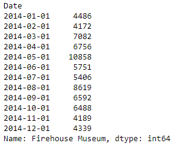

## Project Overview

#### The following is an exploration of a dataset on museum visitors in the US between Jan 2014 to Nov 2018. I load the dataset into an ipynb and perform some EDA and visualisations on it.   

Dataset file: [musemu visitors dataset](museum_visitors.csv)  
Python notebook: [EDA Notebook](museum_visitor_analysis.ipynb)  

## Data and Exploration
The dataset has 5 columns, with 1 column being the date ranging from Jan 2014 to Nov 2018 and 4 other columns being the visitor count of different museums in the US. I explore the following aspects of the data using the full date range provided:
- Visitor count per museum by date  
- Distribution of visitor count for each museum   
- Average visitor count per month for each museum  
- Normalized visitor count to assess seasonality effect over the year    

## Data Cleaning
We see the visitor counts per museum of each year from Jan 2014 to Nov 2018.    
    
Notice the visitor count for Firehouse Museum in Sep 2014 is particularly high. Under the assumption the visitor count is incorrectly recorded and not the result of any event/season/marketing effort, I imputed the visitor count for Firehouse Museum in September 2014.    

Assessing the seasonality of the Firehouse Museum visitors across the years.  
  
Although there is doesn't seem to be a consistent pattern for visitors in September each year, looking at the average of June to August for each year could be a decent approximation of September's visitor numbers.  
Years 2016 and 2017 have September's visitor count at the end of a downtrend whereas for 2015 and 2018, the visitor count ticks upwards. With heavier emphasis on 2015 for being more recent to 2014 as compared to other years, I simply used the mean visitors of June to August.  

See <b>2014-09-01</b> 
Before:  
  

After:  
  

The visitor count per museum of each year from Jan 2014 to Nov 2018 after imputation:  
  

## Data Visualisation  
Distribution of visitor count for each museum:

